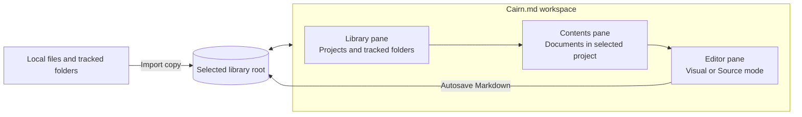
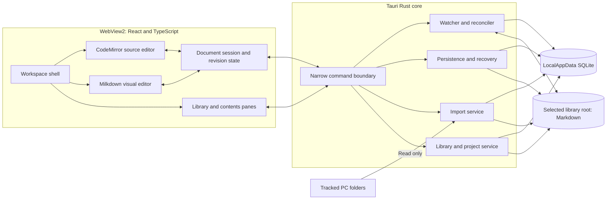
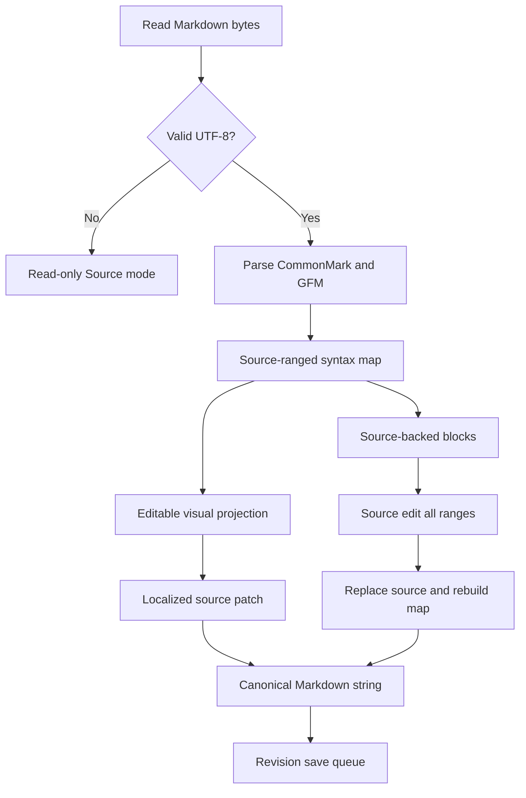
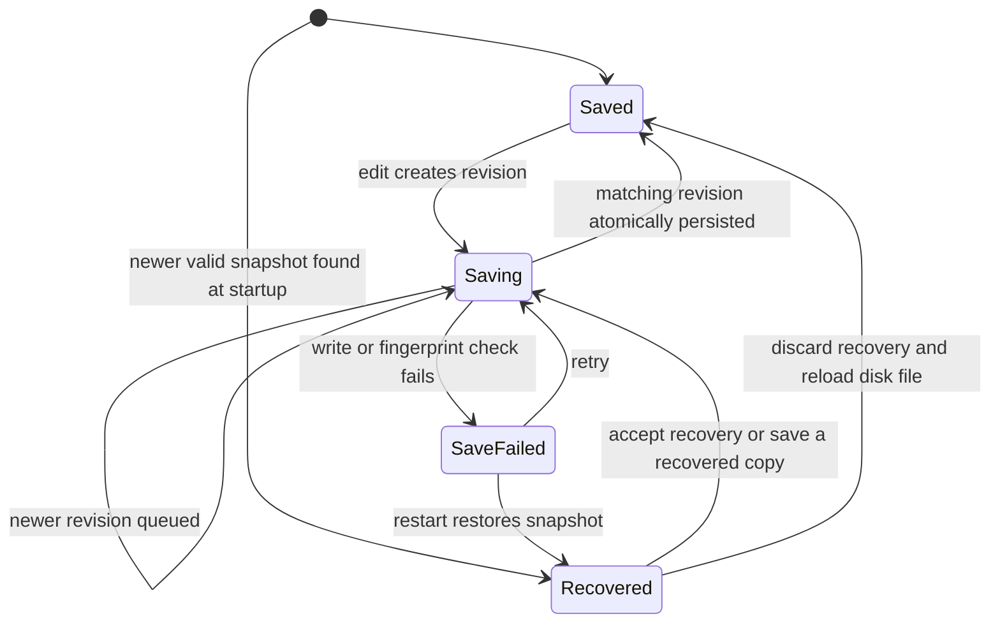
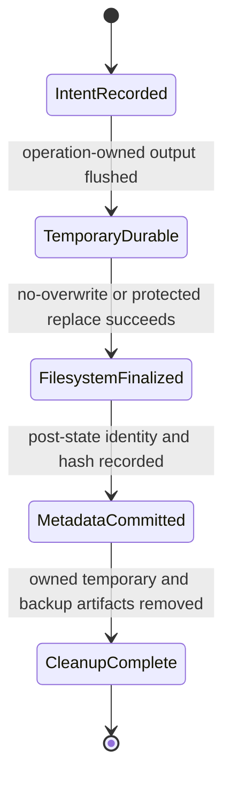
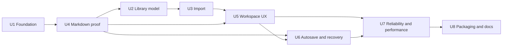

# Cairn.md Product Scope - Plan

## Goal Capsule

- **Objective:** Give Windows knowledge workers a fast, dependable place to collect, organize, read, and edit Markdown documents that would otherwise remain scattered across local downloads and workplace tools.
- **Means:** Build a Tauri 2 desktop application with a Rust core and a TypeScript editor interface over the Windows WebView2 runtime (KTD1).
- **Product authority:** The Product Contract owns user-visible behavior. Key Technical Decisions own implementation mechanisms. Implementation Units may not weaken either contract.
- **Product Contract preservation:** Amended to adopt the Cairn.md product name and express the release sequence as SemVer: `v0.1.0`, `v0.2.0`, and public launch `v1.0.0`. MVP requirements R1-R30 are unchanged.
- **Execution profile:** Execute the units in the dependency order shown in Sequencing. Keep each unit independently reviewable.
- **Stop conditions:** Stop and return to planning if the Markdown corpus cannot preserve unsupported syntax through a no-op Visual-mode round trip, or if a user-content mutation cannot be constrained to the selected library root.
- **Tail ownership:** Implementation includes source, tests, documentation, CI, and a locally buildable unsigned installer. Publishing a GitHub release and production code signing require the repository owner’s credentials and explicit release action.
- **Open blockers:** None.

---

## Product Contract

### Summary

Cairn.md is a Windows-first desktop application for managing a personal library of portable Markdown documents.
Its MVP combines copy-based import, top-level project organization, direct visual editing, source editing, autosave, and light or dark reading in one local workspace.

### Problem Frame

Markdown files increasingly arrive through Teams chats, email, SharePoint, downloads, and AI tools such as Codex and Claude.
Their original locations are hard to remember, while the viewers embedded in those tools are optimized for immediate reading rather than later retrieval, organization, or editing.
Opening files in unrelated editors fragments the workflow further and makes a growing document collection difficult to manage.

### Key Decisions

- **Managed library instead of a general file explorer.** (session-settled: user-directed — chosen over editing files in place: the primary need is reliable rediscovery and organization.) Governs R2, R4, R7, R8.
- **Independent copy on every import.** (session-settled: user-directed — chosen over linked or deduplicated imports: the same source may need to evolve differently across projects.) Governs R9, R10.
- **Direct visual editing as the default.** (session-settled: user-directed — chosen over separate edit and preview panes: the rendered document should remain editable.) Governs R14, R16.
- **Portable Markdown over proprietary document features.** (session-settled: user-directed — chosen for the broadest compatibility when sharing edited files with colleagues.) Governs R18, R19.
- **One relocatable library root.** (session-settled: user-directed — chosen over fixed absolute internal paths: moving the library must not break its organization.) Governs R2, R3, R6.
- **Release the focused library and editor before deeper organization and retrieval.** (session-settled: user-directed — chosen over shipping subprojects, Git, and search together: the essential workflow should arrive first.) Governs R4, R21, R22, R23, R24, R25.

<!-- ce-section: work-relationships -->
### How This Work Fits Together

This plan owns the Cairn.md `v0.1.0` MVP as one coherent work unit.
The broader breakdown below is the current product direction rather than a committed roadmap.

- **v0.2.0 depends on the v0.1.0 project, document, and metadata model.** It adds nested subprojects, tags, fuzzy metadata search, ranked full-text search, filters, and saved organized views.
  - Tags support retrieval and views only and never alter Markdown content.
  - Fuzzy matching applies to metadata such as filenames, titles, tags, project names, and paths rather than every content word.
  - Full-text results use ranked matching with contextual snippets.
- **v1.0.0 is the first publicly announced release and depends on the v0.2.0 hierarchy.** It adds one local Git repository per top-level project, manual named versions, automatic recovery checkpoints, minimal Git state, and document history navigation.
  - Git history spans the top-level project and all of its subprojects.
  - Autosave remains separate from Git commits.
  - The visible Git state is limited to `Committed · <short hash>` or `Uncommitted changes · <short hash>`.
  - Branches, staging, remotes, merge states, and ahead or behind states are not exposed.
  - A document history view lists older committed versions of the selected `.md` file.
  - The user can open an older version read-only and compare it with the current document in a readable diff view.

### Actors

- A1. **Library owner:** A Windows user who imports, organizes, reads, edits, and shares Markdown documents.
- A2. **Windows file system:** Stores the library, source folders, imported copies, app metadata, and recovery data.
- A3. **External source location:** A local folder containing Markdown files obtained from workplace tools, downloads, AI tools, or the user's own file organization.

### Requirements

**Platform and library**

- R1. Cairn.md must run as a Windows-first desktop application without requiring an account, internet connection, or cloud service for its core workflow.
- R2. The user must select one writable folder as the active Cairn.md library root.
- R3. Cairn.md must store internal project and document references relative to the active library root so the whole library can be moved and relinked.
- R4. The MVP must organize documents into top-level projects and must not expose nested subprojects.
- R5. The library workspace must let the user create and rename top-level projects and create, rename, move, or delete documents.
- R6. Cairn.md must rescan and reconcile files or folders moved or renamed within the library root without creating duplicate library entries.

**Import and provenance**

- R7. The MVP must import `.md` files through a file picker, drag and drop, or the Tracked PC Folders section.
- R8. Tracked PC Folders must be a collapsible, import-only view of user-selected folders and must never modify source files.
- R9. Every import must create an independent copy inside the selected top-level project, even when the same source was imported before.
- R10. When an imported filename already exists at the destination, Cairn.md must preserve both documents by assigning the new copy the smallest available numbered name such as `proposal (2).md`.
- R11. Cairn.md must keep the original absolute source path, import date and time, and current library-relative path in app-owned metadata rather than writing them into the Markdown file.
- R12. After a successful import, the library copy must remain usable when the original file is moved, changed, or removed.

**Workspace and editing**

- R13. The primary workspace must keep the library hierarchy on the left, the selected project's document list in a resizable and collapsible middle pane, and the active document editor on the right.
- R14. Visual mode must be the default editor and must allow direct editing of the rendered document without a separate preview pane.
- R15. Visual mode must provide discoverable controls and standard keyboard shortcuts for common Markdown formatting, including headings, emphasis, links, lists, task lists, quotes, code, and tables.
- R16. Source mode must edit the same underlying Markdown file and act as the fallback for syntax that is difficult or ambiguous to edit visually.
- R17. The MVP must not include separate Preview or Split modes.
- R18. Cairn.md must read and write CommonMark plus GitHub Flavored Markdown without adding proprietary document syntax.
- R19. Switching between Visual and Source modes must preserve unsupported or ambiguous Markdown syntax without content loss.
- R20. The user must be able to select Light, Dark, or Follow Windows appearance while reading or editing.

The workspace relationship is:



**Saving and recovery**

- R21. Cairn.md must autosave every document edit without requiring or presenting a normal manual-save workflow.
- R22. The save indicator must use only `Saving…`, `Saved`, `Save failed`, or `Recovered` as user-facing persistence states in the MVP.
- R23. If a save fails, Cairn.md must retain the user's latest recoverable content and provide a clear retry path.
- R24. After forced termination, Cairn.md must recover all but at most two seconds of acknowledged editing work.

**Performance and reliability**

- R25. Cairn.md must reach an interactive library workspace within 1.5 seconds of a cold launch on the agreed reference Windows work laptop.
- R26. Editor input must respond within 50 milliseconds during normal editing.
- R27. A normal Markdown document must open for interaction within 250 milliseconds.
- R28. Cairn.md must use less than 150 MB of memory while idle with a library open.
- R29. Autosave, import, project management, editor mode switching, and theme switching must not visibly interrupt typing.
- R30. Normal import, editing, theme switching, and project management must not crash the application or corrupt Markdown content.

### Key Flows

- F1. **Create or open a library**
  - **Trigger:** A1 starts Cairn.md without an available active library or chooses to relocate the library.
  - **Steps:** A1 selects the library root; Cairn.md validates write access; Cairn.md loads relative project and document references; Cairn.md presents the workspace.
  - **Outcome:** The user can resume work from the selected library location.
  - **Covers R1, R2, R3, R4, R6.**
- F2. **Import a Markdown document**
  - **Trigger:** A1 chooses a file, drops a file into a project, or selects a file from A3 through Tracked PC Folders.
  - **Steps:** A1 selects a destination project; Cairn.md copies the file; Cairn.md resolves any filename collision; Cairn.md records provenance; Cairn.md opens or selects the library copy.
  - **Outcome:** A new independent Markdown document is available in the project.
  - **Covers R7, R8, R9, R10, R11, R12.**
- F3. **Read and edit a document**
  - **Trigger:** A1 selects a document from the contents pane.
  - **Steps:** Cairn.md opens it in Visual mode; A1 edits rendered content or switches to Source mode; A1 may select Light, Dark, or Follow Windows without interrupting the active edit; Cairn.md autosaves changes; the persistence indicator reflects the result.
  - **Outcome:** The portable `.md` file contains the latest saved content while the document list remains available for reference.
  - **Covers R13, R14, R15, R16, R17, R18, R19, R20, R21, R22.**
- F4. **Recover from an interrupted save**
  - **Trigger:** Cairn.md cannot complete a save or terminates unexpectedly during editing.
  - **Steps:** Cairn.md retains recoverable content; on restart it restores the latest valid state; Cairn.md identifies the restored state as `Recovered` or presents a retry after `Save failed`.
  - **Outcome:** A1 can continue without silent data loss.
  - **Covers R23, R24, R30.**

### Acceptance Examples

- AE1. **Importing the same source twice**
  - **Covers R9, R11, R12.**
  - **Given:** `brief.md` has already been imported into Project Alpha.
  - **When:** A1 imports the same source file into Project Beta.
  - **Then:** Project Beta receives a separate editable copy with its own library-relative location and import record.
- AE2. **Resolving a filename collision**
  - **Covers R10.**
  - **Given:** A project contains `proposal.md` and `proposal (2).md`.
  - **When:** A1 imports another file named `proposal.md` into that project.
  - **Then:** Cairn.md creates `proposal (3).md` without overwriting either existing document.
- AE3. **Working from a tracked folder**
  - **Covers R7, R8, R12.**
  - **Given:** A1 has added a folder to Tracked PC Folders.
  - **When:** A1 selects one of its Markdown files and imports it into a project.
  - **Then:** Editing the imported document changes only the library copy and does not modify the source file.
- AE4. **Relocating the library**
  - **Covers R3, R6.**
  - **Given:** A1 moves the complete library root to another local drive.
  - **When:** A1 selects the new root location in Cairn.md.
  - **Then:** Existing projects, documents, and app metadata resolve from relative references without manual repair of each item.
- AE5. **Preserving complex Markdown**
  - **Covers R16, R18, R19.**
  - **Given:** A document contains valid CommonMark or GitHub Flavored Markdown that Visual mode cannot represent directly.
  - **When:** A1 edits another part of the document in Visual mode and then opens Source mode.
  - **Then:** The original unsupported syntax remains intact and editable in the same `.md` file.
- AE6. **Recovering after forced termination**
  - **Covers R21, R22, R23, R24.**
  - **Given:** A1 is typing while autosave is active.
  - **When:** The process is forcibly terminated and Cairn.md is restarted.
  - **Then:** Cairn.md restores all but at most the final two seconds of acknowledged editing work and labels the restoration `Recovered`.

### Scope Boundaries

**Deferred for later**

- Nested subprojects, tags, search, and saved views are `v0.2.0` candidates described in How This Work Fits Together.
- Local Git, named versions, per-document history navigation, historical read-only viewing, and current-to-history diffs are `v1.0.0` candidates described in How This Work Fits Together.

**Outside this product's initial identity**

- Editing or synchronizing tracked source files in place.
- Cloud storage, cloud synchronization, shared live editing, or required user accounts.
- Developer-oriented Git workflows such as branches, staging, remotes, pull requests, and merge resolution.
- Proprietary Markdown extensions that reduce portability.
- macOS, Linux, mobile, or web releases before the Windows product is established.

### Dependencies and Assumptions

- The active library root and each imported source file are accessible through the Windows file system when the relevant operation begins.
- Users have permission to read imported sources and write to the selected library root.
- Imported files are already available locally. Retrieving attachments directly from Teams, email, SharePoint, Codex, or Claude is outside the MVP.
- The reference performance profile is Windows 11 x64, a four-core CPU, 8 GB RAM, an SSD, and the current stable Evergreen WebView2 runtime.
- A normal performance-test document is UTF-8 Markdown of approximately 250 KB or 5,000 lines with representative CommonMark and GFM structures.

---

## Planning Contract

### Key Technical Decisions

- KTD1. Use Tauri 2 for the desktop shell, Rust for trusted operating-system work, and React with TypeScript and Vite for the WebView2 interface. (session-settled: user-approved — chosen over native WinUI and Electron: the web editor ecosystem supports Markdown-first visual editing in one UI stack while Tauri avoids bundling a browser runtime.) Governs R1, R13-R20, R25-R30.
- KTD2. Store canonical user content as `.md` files below the selected library root. Each MVP project is one direct child directory and each managed document is one direct `.md` child of its project. Store library identity, binding generation, settings, provenance, relative-path indexes, and recovery snapshots in a `rusqlite` database below `%LOCALAPPDATA%\Cairn.md`. An explicit relink operation validates a candidate root, shows a match summary, and requires confirmation before replacing the previous binding; project and document paths remain relative to the bound root. Governs R2-R6, R11, R23, R24.
- KTD3. Keep the exact Markdown source string canonical. Use Milkdown 7 with CommonMark and GFM presets as a Visual-mode projection and CodeMirror 6 for Source mode. Parsed nodes retain source ranges, and Visual-mode transactions produce localized source patches instead of serializing the full editor tree. Unsupported syntax remains in source-backed blocks; Source-mode edits replace the canonical string and rebuild all mappings. (session-settled: user-approved — chosen over rejecting the whole document or normalizing unknown syntax: source-backed blocks preserve portable Markdown without hiding the rest of the visual editor.) Governs R14-R19.
- KTD4. Route file picker, drag-and-drop, and Tracked PC Folder imports through one Rust import service. Copy through an operation-owned same-directory temporary file and compare the source identity and fingerprint before and after the copy. Finalize with no-overwrite semantics, retry collision allocation if the target appears concurrently, and commit provenance only after the destination is durable and verified. Governs R7-R12, R29, R30.
- KTD5. Use `current_revision`, `durable_snapshot_revision`, and `disk_revision` in one serial document queue. Treat an edit as acknowledged when the UI assigns `current_revision` and queues recovery. Advance `durable_snapshot_revision` at least once per second and before releasing a document session; coalesce newer work while one disk write is in flight. Mark `Saved` only when `disk_revision` equals `current_revision`, and clear a snapshot only after its intended content hash matches disk. Governs R21-R24, R29, R30.
- KTD6. Compare the disk fingerprint with the editor’s base fingerprint whenever reconciliation detects change and again while a Win32 handle denies new writers but permits replacement. Use an operation-owned backup during `ReplaceFileW`; fail closed if the protected operation cannot be established. Reload the disk file when no local revision is pending. Otherwise stop autosave, durably capture the external bytes and current draft, show `Save failed`, and offer reload or save-recovered-copy actions. Never retry against a new fingerprint without user action. (session-settled: user-approved — chosen over silent last-writer-wins: external changes must not be overwritten or disguised as version history.) Governs R22, R23, R30.
- KTD7. Treat file-watcher events as hints. Debounce them and run an authoritative scan that normalizes Windows paths case-insensitively and suppresses self-generated save events by operation ID. Rebind identity only for one unambiguous file-identity match or one uniquely high-confidence fallback; ambiguous files receive separate records. Hash lazily only when cheaper facts cannot disambiguate. Governs R3, R6, R11, R25, R29, R30.
- KTD8. Expose narrow Tauri commands instead of general frontend filesystem access. Resolve and validate every library mutation target in Rust, reject traversal and reparse-point escape outside the library root, and keep tracked folders read-only. Reject a tracked folder that is the library root or its descendant. Governs R1-R3, R5, R8, R29, R30.
- KTD9. Distribute an x64 NSIS installer that uses the system Evergreen WebView2 runtime and includes Microsoft’s small WebView2 bootstrapper for missing runtimes. (session-settled: user-approved — chosen over bundling a fixed offline runtime: the compact installer preserves the lightweight goal and receives Windows-managed runtime security updates.) Governs R1, R25, R28, R30.
- KTD10. Make the release performance thresholds in R25-R28 automated proof gates. Measure a release build on the reference profile and keep parsing, database, watcher, and filesystem work off the UI thread. Governs R25-R29.
- KTD11. Use a durable operation journal for changes that span SQLite and the filesystem. Legal phases are `Intent recorded`, `Temporary durable`, `Filesystem finalized`, `Metadata committed`, and `Cleanup complete`. Each entry owns expected pre-state, post-state, file identity, fingerprints, and temporary paths. Startup replay advances each operation exactly once and removes only an operation-owned artifact with a matching fingerprint. Governs R5-R12, R23, R30.
- KTD12. Probe a candidate root for the required create, flush, no-overwrite rename, atomic replacement, and recoverable-delete semantics before accepting it. If an existing root loses a required capability, make affected documents read-only and preserve recovery data instead of attempting a weaker write. Governs R2, R5-R10, R21-R24, R30.
- KTD13. Run SQLite migration and integrity checks before enabling library mutations. If the database or WAL is damaged, quarantine it without silent reinitialization and open the library read-only until a verified backup is restored or the user explicitly rebuilds the index. Rebuilding may recover paths but must report that provenance and recovery records can be lost. Governs R3, R6, R11, R23, R30.

### High-Level Technical Design

The WebView owns presentation and editor interaction. Rust owns every trusted persistence and filesystem operation. SQLite is app state, not user content, so a synced or relocated library never contains an open application database.



**Document session and mode switching**

1. Rust reads the selected file as bytes and returns decoded text, line-ending style, BOM state, and a disk fingerprint.
2. The session owns one canonical Markdown string and a monotonically increasing revision number.
3. A CommonMark and GFM parse records source ranges. Milkdown receives a supported projection and source-backed block views for unsupported ranges.
4. A Visual-mode transaction identifies the smallest changed supported range, serializes only that range, and patches the canonical string. It never serializes the full Milkdown tree as the document source.
5. A Source-mode change replaces the canonical string, invalidates every old range, and reparses the whole document before Visual mode can resume.
6. A no-op open, mode switch, or close does not write or normalize the file.
7. Writes preserve the detected UTF-8 BOM and dominant line-ending convention. Invalid UTF-8 opens in non-editable Source mode with an explanatory error and no mutation.



**Persistence state machine**

The frontend derives the visible label from the active revision. Recovery is a durable state, not a substitute for a successful file write.

| Internal value | Meaning |
|---|---|
| `current_revision` | Latest edit acknowledged by the document session. |
| `durable_snapshot_revision` | Latest revision committed to recovery storage. |
| `disk_revision` | Latest revision whose intended hash is proven on disk. |

The queue keeps at most one disk write in flight and coalesces later revisions to the newest pending value. A document switch or close may render the next view immediately, but it retains the previous session until its latest acknowledged revision reaches durable recovery storage.



**Library reconciliation and deletion**

- The library scan is authoritative. Watcher events only schedule scans.
- The database enforces a case-folded unique key for each library-relative path.
- A rename is matched under KTD7. Ambiguous candidates are never merged automatically.
- A Cairn.md replacement records the new file identity and fingerprint through KTD11 before self-generated watcher events are released.
- A whole-library relocation changes only the root binding because indexed paths remain relative.
- Document deletion uses the Windows Recycle Bin. Metadata changes only after the recoverable filesystem operation succeeds.
- The scanner manages only `root/<project>/<document>.md`. It ignores unexpected nested directories, root-level files, operation-owned temporary files, dot-prefixed control directories, and future `.git` directories without deleting them.

**Rendering and link safety**

- Local relative images render only when their resolved path remains inside the library root.
- Remote images do not load automatically in the MVP.
- External links open through the Windows default browser only after a user action.
- The WebView uses a restrictive content security policy and cannot navigate to arbitrary pages inside the Cairn.md window.

### Data Model

The initial migrations create these logical records. U2 owns `0001_library.sql` for app settings, libraries, projects, documents, tracked folders, and pending file operations. U6 owns `0002_recovery.sql` for recovery snapshots and external conflicts.

- `app_settings`: appearance and schema version.
- `libraries`: stable library ID, active root binding, binding generation, prior binding, and a validation manifest held outside the library.
- `projects`: stable ID, library-relative directory, normalized path key, and timestamps.
- `documents`: stable ID, project ID, library-relative file path, normalized path key, source path, imported timestamp, disk fingerprint, confirmed disk revision, and last-seen file identity.
- `tracked_folders`: stable ID, absolute source folder, display name, and last scan time.
- `recovery_snapshots`: document ID, session generation, revision, UTF-8 content, content hash, base fingerprint, intended disk hash, operation ID, lifecycle state, and durable timestamp.
- `external_conflicts`: document ID, operation ID, external bytes and hash, draft revision and hash, and captured timestamp.
- `pending_file_operations`: operation ID, operation kind, source and target facts, serialized metadata intent, phase, and timestamps.

SQLite runs as a single-writer connection in WAL mode with foreign keys enabled and durable synchronization. Migrations are forward-only and transactional. A failed migration leaves the previous schema usable. Startup reconciliation applies KTD11 before the library scan and compares recovery snapshot hashes with current file fingerprints before offering restoration.

**Operation-journal recovery**



Startup may advance a phase only when the recorded pre-state, post-state, ownership token, and fingerprints prove that transition. A second restart must make no further change after reconciliation completes.

### Project Structure

```text
Cairn.md/
├── package.json
├── package-lock.json
├── vite.config.ts
├── src/
│   ├── app/
│   ├── components/
│   ├── features/editor/
│   ├── features/library/
│   ├── features/settings/
│   ├── lib/tauri/
│   └── styles/
├── src-tauri/
│   ├── Cargo.toml
│   ├── capabilities/
│   ├── migrations/
│   ├── tauri.conf.json
│   └── src/
│       ├── commands/
│       ├── domain/
│       ├── infrastructure/
│       └── lib.rs
├── tests/
│   ├── e2e/
│   ├── fixtures/markdown/
│   └── performance/
└── .github/workflows/ci.yml
```

### Sequencing



U1 must prove a thin Rust-to-WebView command and collect baseline startup and memory numbers before feature work grows. U4 is the first stack-adoption gate and must pass the Markdown preservation corpus before library or workspace implementation continues. U2 renders the cached index first and reconciles in the background so startup does not wait for a full scan.

### System-Wide Impact

- The Rust command boundary is the only path from UI intent to disk mutation.
- All three import entry points produce the same collision, provenance, and rollback behavior.
- The canonical Markdown string is the only editable document representation. Visual and Source modes are projections of that value.
- User content and app metadata have separate backup and lifecycle behavior. Removing Cairn.md must not remove the selected library.
- A single-instance guard prevents concurrent Cairn.md processes from writing the same active library. External tools remain supported through KTD6.
- Logging excludes Markdown content and absolute source paths by default. Diagnostics may include operation IDs, relative paths, durations, and error classes.

**Data-integrity invariants**

- A cross-store mutation converges exactly once under KTD11. Repair never deletes a finalized file unless ownership and the expected fingerprint are both proven.
- A recovery snapshot remains until its intended content hash is proven on disk under KTD5. If disk matches neither the base nor intended hash, KTD6 preserves both versions for user resolution.
- Provenance and recovery history move only on an unambiguous identity match under KTD7. Ambiguous files remain separate records.
- A failed root relink preserves the prior binding under KTD2. A candidate root remains untouched until validation succeeds.
- Canonical Markdown stays read-only whenever root capabilities or database integrity cannot support KTD11-KTD13.

### Risks and Dependencies

- **Markdown round-trip loss:** Milkdown or custom schema transforms may normalize valid syntax. Mitigate with a golden corpus, source-backed blocks, byte-level no-op assertions, and the U4 stop condition.
- **Performance budget pressure:** WebView2 memory varies by Windows/runtime version. Capture U1 baselines early, lazy-load the editor, virtualize large lists, and profile release builds before adding features.
- **Watcher inconsistency:** Windows editors emit different event sequences. Treat events as hints and verify state through scans under KTD7.
- **Filesystem safety:** Junctions, symlinks, reparse points, case folding, and network-backed folders can defeat textual prefix checks. Resolve handles and final paths in Rust before writes.
- **Recovery correctness:** Power loss and process termination can interrupt either SQLite or Markdown writes. Use transactional snapshots, atomic replacement, fault injection, and forced-termination tests.
- **Concurrent external writes:** A fingerprint check by itself has a race window. Use the protected Windows replacement protocol in KTD6 and preserve the replacement backup when any postcondition differs.
- **Storage capability drift:** Sync providers, removable media, network shares, and filesystem changes may weaken replacement or recycle semantics after setup. Re-run KTD12 probes after relevant I/O failures and fall back to read-only access.
- **Damaged app metadata:** A corrupt database or interrupted migration can detach provenance and recovery from valid files. Apply KTD13, retain the damaged database and WAL for diagnosis, and never initialize a replacement silently.
- **Toolchain prerequisite:** Development requires Node.js, npm, Rust stable with the MSVC target, WebView2, and Microsoft C++ Build Tools. The current environment has Node.js and npm but has not yet demonstrated the Rust/MSVC toolchain.
- **Unsigned installer warnings:** Local and CI builds remain unsigned until the project owner supplies a trusted Windows signing certificate and release secrets.

### Alternatives Considered

- **Native WinUI 3 shell:** WinUI gives the strongest Windows-native controls, accessibility defaults, and platform integration. Its `RichEditBox` is RTF-oriented rather than Markdown-native, so a comparable visual Markdown editor would require substantial custom parsing and editing work or an embedded WebView2 editor. That hybrid would add a second UI stack without removing the browser runtime. Reconsider WinUI only if a validated accessibility or enterprise-deployment requirement cannot be met in Tauri.
- **Electron:** Electron offers a mature desktop ecosystem and consistent Chromium behavior. It bundles Chromium and Node.js, which conflicts with the installer-size and idle-memory goals before Cairn.md adds product code.
- **Tiptap Markdown:** Tiptap has a capable editor ecosystem, but its official Markdown extension is marked Beta and documents unsupported and lossy cases. Milkdown is the safer Markdown-first starting point for R18 and R19.
- **Metadata inside the library root:** This would make the library self-contained, but it would also expose private provenance and place an open SQLite database inside folders that users may sync through OneDrive or SharePoint. A LocalAppData database plus relative references keeps the Markdown library portable without those risks.
- **Bundled fixed WebView2 runtime:** It enables a fully offline first install but adds roughly 180 MB to distribution. KTD9 keeps the core application offline after install while retaining a small installer.

### Sources and Research

- [Tauri 2 architecture](https://v2.tauri.app/concept/architecture/) and [filesystem plugin](https://v2.tauri.app/plugin/file-system/) support the Rust command boundary and scoped filesystem model in KTD1 and KTD8.
- [Tauri capabilities](https://v2.tauri.app/reference/acl/capability/) informs the least-privilege command and WebView design.
- [Tauri Windows prerequisites](https://v2.tauri.app/start/prerequisites/) defines the Rust, MSVC, and WebView2 developer prerequisites.
- [Tauri Windows installer options](https://v2.tauri.app/distribute/windows-installer/) documents NSIS, Evergreen bootstrapper, offline installer, and fixed-runtime tradeoffs used in KTD9.
- [Tauri WebDriver testing](https://v2.tauri.app/develop/tests/webdriver/) informs the Windows end-to-end test approach.
- [Windows App SDK overview](https://learn.microsoft.com/en-us/windows/apps/windows-app-sdk/) and [RichEditBox guidance](https://learn.microsoft.com/en-us/windows/apps/develop/ui/controls/rich-edit-box) inform the WinUI alternative analysis.
- [ProseMirror’s data model](https://prosemirror.net/docs/guide/) explains why KTD3 keeps source text canonical instead of treating the normalized editor tree as the Markdown source.
- [Microsoft `ReplaceFile` documentation](https://learn.microsoft.com/en-us/windows/win32/api/winbase/nf-winbase-replacefilew) informs the protected replacement and backup behavior in KTD6.
- [Milkdown guide](https://milkdown.dev/docs/guide/why-milkdown) and [Milkdown repository](https://github.com/Milkdown/milkdown) support the Markdown-first Visual-mode choice in KTD3.
- [Tiptap Markdown limitations](https://tiptap.dev/docs/editor/markdown) inform the rejected editor alternative.
- [CodeMirror 6 changelog](https://codemirror.net/docs/changelog/) supports the maintained Source-mode choice.
- [`rusqlite` documentation](https://docs.rs/crate/rusqlite/latest) and [SQLite transactional guarantees](https://www.sqlite.org/transactional.html) inform KTD2 and KTD5.
- [`notify` documentation](https://docs.rs/crate/notify/latest) informs the watcher-plus-rescan design in KTD7.

---

## Implementation Units

### U1. Establish the Windows application foundation

- **Goal:** Produce a minimal release-buildable Tauri application with a measured Rust-to-WebView vertical slice.
- **Requirements:** R1, R25, R28, R30. KTD1, KTD8, KTD9, KTD10.
- **Dependencies:** None.
- **Files:** `package.json`, `package-lock.json`, `vite.config.ts`, `tsconfig.json`, `src/app/`, `src/lib/tauri/`, `src-tauri/Cargo.toml`, `src-tauri/Cargo.lock`, `src-tauri/tauri.conf.json`, `src-tauri/capabilities/`, `src-tauri/src/lib.rs`, `.github/workflows/ci.yml`, `tests/performance/startup.ts`.
- **Approach:** Scaffold React, TypeScript, Vite, and Tauri 2. Add strict TypeScript, Rust formatting and lint policy, a narrow health command, single-instance startup, production logging, and a basic error boundary. Add release-build timing and process-memory probes before editor dependencies are introduced. Pin direct dependency versions and retain `package-lock.json` and `src-tauri/Cargo.lock`.
- **Test scenarios:** Launch without network access. Invoke the health command through the WebView. Attempt an unregistered command and confirm denial. Launch a second instance and confirm focus returns to the first. Record release startup and idle-memory baselines.
- **Verification:** Pass V1, V2, and V6. Record non-gating startup and memory baselines for later comparison in V7.

### U4. Prove the lossless dual-mode Markdown foundation

- **Goal:** Establish one Markdown session that Visual and Source modes can edit without silent syntax loss.
- **Requirements:** R14, R16-R19. KTD3.
- **Product trace:** F3, AE5.
- **Dependencies:** U1.
- **Files:** `src/features/editor/session/`, `src/features/editor/visual/`, `src/features/editor/source/`, `src/features/editor/markdown/`, `tests/fixtures/markdown/`, `src/features/editor/markdown/roundtrip.test.ts`, `tests/e2e/editor-modes.spec.ts`.
- **Approach:** Integrate Milkdown and CodeMirror behind a shared revisioned session. Implement KTD3 as a source-ranged visual projection with localized source patches and source-backed blocks. Preserve UTF-8 BOM and line-ending style. Build a corpus for CommonMark, GFM tables and task lists, nested structures, HTML, reference links, escapes, comments, front matter, math-like unknown syntax, and malformed input. Stop stack adoption if no-op byte preservation or supported-edit containment fails.
- **Test scenarios:** Open and close without edits. Switch modes repeatedly. Edit before and after unsupported blocks. Edit unsupported content in Source mode. Test empty, large, CRLF, LF, and BOM documents. Open invalid UTF-8 and confirm no write occurs.
- **Verification:** Pass V1-V4 and V6. Pass the AE5 and editor-mode subset of V5 with `src/features/editor/markdown/roundtrip.test.ts` and `tests/e2e/editor-modes.spec.ts` green. Record non-gating input and document-projection measurements for V7.

### U2. Implement the relocatable library and project model

- **Goal:** Let the user bind one library root and manage top-level projects and Markdown documents through stable relative references.
- **Requirements:** R2-R6, R11. KTD2, KTD7, KTD8, KTD11-KTD13.
- **Product trace:** F1, AE4.
- **Dependencies:** U1, U4.
- **Files:** `src/features/library/`, `src/lib/tauri/library.ts`, `src-tauri/migrations/0001_library.sql`, `src-tauri/src/commands/library.rs`, `src-tauri/src/domain/library.rs`, `src-tauri/src/domain/project.rs`, `src-tauri/src/infrastructure/database.rs`, `src-tauri/src/infrastructure/filesystem.rs`, `src-tauri/src/infrastructure/watcher.rs`, `src-tauri/tests/library_lifecycle.rs`.
- **Approach:** Add transactional migrations, stable library identity, binding generations, capability probes, integrity checks, and the operation journal. Store only relative project and document paths in index records. Render the cached index before background reconciliation. Implement project and document CRUD, recoverable deletion, explicit relink, startup repair, watcher hints, and an idempotent authoritative reconciler. Keep nested directories invisible as projects in the MVP.
- **Test scenarios:** Cover first launch, cancelled selection, writable, read-only, missing, temporarily unavailable, non-empty, and capability-incompatible roots. Confirm failed selection retains the prior binding. Create and rename projects. Create, rename, move, and recycle documents. Relocate the full root; copied and unrelated candidates must not inherit its identity without confirmed relink. Exercise case-only renames, identical copies, rename-plus-edit, file swaps, cross-volume moves, junction escape, corrupt database and WAL, interrupted migrations, and two consecutive repair restarts. Verify ambiguous matches remain separate and rescans never create duplicates.
- **Verification:** Pass V1-V3 and V6 with `src-tauri/tests/library_lifecycle.rs` green.

### U3. Build one safe import pipeline and Tracked PC Folders

- **Goal:** Import independent Markdown copies through all three MVP entry points without touching source files.
- **Requirements:** R7-R12. KTD4, KTD8, KTD11, KTD12.
- **Product trace:** F2, AE1-AE3.
- **Dependencies:** U2.
- **Files:** `src/features/library/import/`, `src/features/library/tracked-folders/`, `src/lib/tauri/import.ts`, `src-tauri/src/commands/import.rs`, `src-tauri/src/domain/import.rs`, `src-tauri/src/infrastructure/copy.rs`, `src-tauri/tests/import_pipeline.rs`, `tests/e2e/import.spec.ts`.
- **Approach:** Add file picker, drag-and-drop, and tracked-folder selection as adapters to one import command. Accept case-insensitive `.md` extensions and apply KTD4 and KTD11 for copying, collision allocation, provenance, and repair. A successful adapter selects and opens the new library copy in Visual mode.
- **Test scenarios:** Confirm all three entry points produce equivalent copies and exact source-path, import-time, and relative-path provenance. Test importing the same source into two projects and importing an existing library file as a new copy. With `proposal.md` and `proposal (3).md` present, confirm the next file is `proposal (2).md`. Exercise cancellation, non-Markdown input, locked files, disk-full simulation, disappearing or changing sources, concurrent destination creation, invalid Windows filenames, and tracked-folder overlap. Terminate before and after finalization, then restart twice. Verify source bytes and timestamps never change and failed pre-finalization imports leave no document or provenance.
- **Verification:** Pass V1-V3 and V6. Pass the F2 and AE1-AE3 subset of V5 with `src-tauri/tests/import_pipeline.rs` and `tests/e2e/import.spec.ts` green.

### U5. Complete the three-pane workspace and visual editing experience

- **Goal:** Deliver the primary library, contents, and directly editable document workflow with accessible formatting and appearance controls.
- **Requirements:** R5, R13-R17, R20, R29. KTD1, KTD3.
- **Product trace:** F1, F3.
- **Dependencies:** U3, U4.
- **Files:** `src/app/`, `src/components/layout/`, `src/features/library/components/`, `src/features/editor/components/`, `src/features/editor/formatting/`, `src/features/settings/appearance/`, `src/styles/`, `src/features/editor/formatting/toolbar.test.tsx`, `tests/e2e/workspace.spec.ts`, `tests/e2e/accessibility.spec.ts`.
- **Approach:** Implement the left library tree, collapsible tracked folders, resizable and collapsible contents pane, and right editor. Add keyboard navigation, focus restoration, toolbar labels, shortcuts, empty states, and responsive minimum widths. Use Windows appearance detection for Follow Windows and shared design tokens for Light and Dark modes. Keep Preview and Split affordances absent.
- **Test scenarios:** Complete F1 and the navigation, formatting, mode-switching, and appearance portions of F3 by mouse and keyboard. Collapse and resize the contents pane while retaining the active document. Apply every R15 format to selections and empty carets. Switch appearance during typing. Verify focus order, labels, contrast, zoom, and reduced-motion behavior.
- **Verification:** Pass V1-V4 and V6. Pass the workspace and accessibility subset of V5. Record a non-gating integrated startup, open, input, and memory checkpoint for V7.

### U6. Implement durable autosave, recovery, and external-change protection

- **Goal:** Save continuously, recover acknowledged work after termination, and prevent silent overwrite of externally changed files.
- **Requirements:** R21-R24, R29, R30. KTD4-KTD6, KTD11-KTD13.
- **Product trace:** F3, F4, AE6.
- **Dependencies:** U4, U5.
- **Files:** `src/features/editor/persistence/`, `src/features/editor/recovery/`, `src/lib/tauri/persistence.ts`, `src-tauri/migrations/0002_recovery.sql`, `src-tauri/src/commands/persistence.rs`, `src-tauri/src/domain/recovery.rs`, `src-tauri/src/infrastructure/atomic_write.rs`, `src-tauri/tests/persistence_faults.rs`, `tests/e2e/autosave-recovery.spec.ts`.
- **Approach:** Implement the revision counters, coalescing queue, one-second durable recovery cadence, protected replacement, external-conflict snapshots, retry, reload, collision-safe recovered copies, startup restoration, and journal repair. Derive only the four R22 labels. Add deterministic fault and race points around snapshot commit, handle acquisition, final fingerprint, replacement, metadata update, and cleanup.
- **Test scenarios:** Run complete F3 and F4. Confirm `Saved → Saving… → Saved`, and prove an older write cannot mark a newer revision saved. Deny and restore write access. Verify no fifth persistence label appears. Reload a clean external edit; conflict on a pending local edit; then modify or delete the external file again while resolution is open. Test retry, accept recovery, discard recovery, and save recovery as a numbered document. Test snapshots that are newer than, equal to, older than, invalid for, or divergent from disk. Keep Visual and Source modes synchronized while saves are pending. Switch themes and panes during saving. Terminate at each KTD11 phase and throughout the snapshot interval, restart twice, and verify recovery lag is at most two seconds with neither version lost.
- **Verification:** Pass V1-V6 with `src-tauri/tests/persistence_faults.rs` and `tests/e2e/autosave-recovery.spec.ts` green.

### U7. Harden reliability and meet the performance contract

- **Goal:** Demonstrate the complete MVP stays responsive, within its resource budget, and corruption-free under representative and adverse workloads.
- **Requirements:** R25-R30. KTD7, KTD10.
- **Dependencies:** U5, U6.
- **Files:** `tests/performance/`, `tests/e2e/stress.spec.ts`, `src-tauri/tests/reconcile_stress.rs`, `scripts/performance/`, `docs/PERFORMANCE.md`, affected profiling fixes under `src/` and `src-tauri/src/`.
- **Approach:** Build repeatable release-mode benchmarks for cold start, idle memory, document open, and input latency. Profile before optimizing. Lazy-load editor modes, virtualize lists when measurement requires it, move CPU and I/O work off the UI thread, and batch watcher reconciliation. Run long editing, import, relocation, and mode-switch stress scenarios with content hashes and crash monitoring.
- **Test scenarios:** Measure the reference normal document and larger boundary documents. Open libraries with 1,000 and 10,000 documents. Import batches during continuous typing. Trigger watcher bursts. Run repeated mode and theme switching. Compare all resulting Markdown bytes or normalized intended edits against test oracles.
- **Verification:** Pass V1-V7. Record environment, raw samples, p50, p95, maximum, and pass or fail results in `docs/PERFORMANCE.md`.

### U8. Package, document, and prepare the open-source release

- **Goal:** Produce a reproducible Windows installer and user and contributor guidance for the verified MVP.
- **Requirements:** R1, R20, R25, R28, R30. KTD9, KTD10.
- **Dependencies:** U7.
- **Files:** `src-tauri/tauri.conf.json`, `.github/workflows/ci.yml`, `README.md`, `CONTRIBUTING.md`, `docs/USER_GUIDE.md`, `docs/ARCHITECTURE.md`, `docs/RELEASE.md`, `docs/TROUBLESHOOTING.md`.
- **Approach:** Configure the x64 NSIS target, Evergreen bootstrapper, icons, metadata, and upgrade identity. Add reproducible CI checks and retain the unsigned installer as an artifact. Document library backup and relocation, tracked-folder safety, autosave and recovery, source-only blocks, installer prerequisites, local builds, architecture, diagnostics, and conditional signing. Do not add an auto-updater in the MVP.
- **Test scenarios:** Install, launch, upgrade, and uninstall on a clean Windows sandbox with and without WebView2 present. Confirm uninstall leaves the library intact. Complete F1-F4 from the installed build with networking disabled after installation.
- **Verification:** Pass V1-V8 and complete the release checklist in `docs/RELEASE.md`.

---

## Verification Contract

The implementation creates the scripts named below. A unit-level reference to V5 means the named flow subset that exists at that point; full V5 becomes mandatory after U6. CI runs V1-V6 on every pull request after U6. A Windows release candidate must also pass V7 and V8.

- V1. **Frontend static quality:** `npm run lint` and `npm run typecheck` complete without warnings or errors.
- V2. **Rust static quality:** `cargo fmt --manifest-path src-tauri/Cargo.toml --check` and `cargo clippy --manifest-path src-tauri/Cargo.toml --all-targets --all-features -- -D warnings` pass.
- V3. **Unit and integration tests:** `npm test -- --run` and `cargo test --manifest-path src-tauri/Cargo.toml --all-features` pass.
- V4. **Markdown preservation corpus:** `npm run test:markdown` passes byte-identical no-op checks and expected-edit golden files for every fixture in `tests/fixtures/markdown/`.
- V5. **Windows desktop flows:** `npm run test:desktop` passes F1-F4, AE1-AE6, keyboard, accessibility, offline, and external-change scenarios through Tauri WebDriver on Windows. Fast mocked flow coverage remains available through `npm run test:flows`.
- V6. **Production build:** `npm run build` and `npm run tauri build` succeed without undeclared network access at application runtime.
- V7. **Release reliability and performance:** `npm run perf` runs against the x64 release binary on the reference profile. It passes only when cold-start interactive time is at most 1.5 seconds p95, editor input latency is at most 50 ms p95, normal document open time is at most 250 ms p95, idle working-set memory is below 150 MB, recovery lag is at most two seconds, and stress runs produce no crash or unintended content change.
- V8. **Installer validation:** `npm run release:validate` builds and smoke-tests the NSIS installer with WebView2 present. `npm run release:verify-webview2` verifies Tauri's generated missing-runtime install branch and proves that the final installer contains the same Microsoft-signed bootstrapper used at build time. GitHub's Windows Server runners cannot remove their required WebView2 component, so a v0.1.0 prerelease may use this package proof while disclosing that clean-client missing-runtime execution remains open. A stable release must also install on a clean Windows client without WebView2 and then complete the core workflow offline.

### Product Evidence Map

| Product evidence | Primary automated evidence |
|---|---|
| F1, AE4 | `src-tauri/tests/library_lifecycle.rs`, `tests/e2e/workspace.spec.ts` |
| F2, AE1-AE3 | `src-tauri/tests/import_pipeline.rs`, `tests/e2e/import.spec.ts` |
| F3 | `tests/e2e/editor-modes.spec.ts`, `tests/e2e/workspace.spec.ts`, `tests/e2e/autosave-recovery.spec.ts` |
| AE5 | `src/features/editor/markdown/roundtrip.test.ts`, `tests/e2e/editor-modes.spec.ts` |
| F4, AE6 | `src-tauri/tests/persistence_faults.rs`, `tests/e2e/autosave-recovery.spec.ts`, `tests/performance/recovery.ts` |
| R5 lifecycle | `src-tauri/tests/library_lifecycle.rs`, `tests/e2e/workspace.spec.ts` |

### Measurement Rules

- Use a release build for V7. Record the Windows version, CPU, RAM, storage, WebView2 version, and Cairn.md commit.
- Use at least 20 independent samples for each latency metric. Discard only documented harness failures, never slow valid samples.
- Measure cold start from process creation until the library and editor can accept input. Close Cairn.md and allow the harness to reset between samples.
- Measure input latency from the input event timestamp through the first painted frame that displays the edit.
- Measure idle memory as the Cairn.md process-tree working set after a library and one normal document have been open without input for 60 seconds.
- Preserve raw results as CI artifacts and summarize them in `docs/PERFORMANCE.md`.

---

## Definition of Done

Cairn.md `v0.1.0` is done when all of the following are true:

- U1-U8 meet their goals and their named tests exist at the planned paths.
- R1-R30 and AE1-AE6 are covered by automated tests or an explicit installer checklist item.
- V1-V8 pass on the reference Windows profile from a clean clone.
- The Markdown corpus demonstrates no mutation on open, no-op mode switching, or close, including source-backed blocks.
- Fault-injection and forced-termination evidence demonstrates the R23 and R24 recovery guarantees.
- The installer leaves the user-selected library intact during upgrade and uninstall.
- `README.md`, `CONTRIBUTING.md`, `docs/USER_GUIDE.md`, `docs/ARCHITECTURE.md`, `docs/PERFORMANCE.md`, `docs/RELEASE.md`, and `docs/TROUBLESHOOTING.md` describe the shipped behavior.
- No application log, database field, or diagnostic artifact stores Markdown content or source paths beyond the app-owned records required by R11 and R23.
- Dead-end dependencies, experimental code, temporary fixtures, debug flags, and obsolete migrations from abandoned approaches are removed.
- The final Git working tree contains only intentional changes.

### Requirement Coverage

| Requirement | Primary implementation unit |
|---|---|
| R1 | U1, U8 |
| R2-R6 | U2 |
| R7-R12 | U3 |
| R13-R20 | U4, U5 |
| R21-R24 | U6 |
| R25-R30 | U7, U8 |
