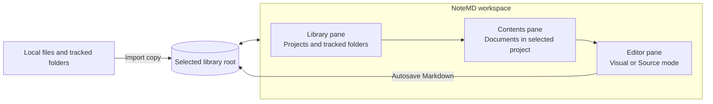

# NoteMD Product Scope - Plan

## Goal Capsule

- **Objective:** Give Windows knowledge workers a fast, dependable place to collect, organize, read, and edit Markdown documents that would otherwise remain scattered across local downloads and workplace tools.
- **Means:** Build a lightweight local desktop application around a user-selected, relocatable Markdown library.
- **Product authority:** This contract defines the MVP product behavior and records later release candidates without committing their implementation.
- **Open blockers:** None.

---

## Product Contract

### Summary

NoteMD is a Windows-first desktop application for managing a personal library of portable Markdown documents.
Its MVP combines copy-based import, top-level project organization, direct visual editing, source editing, autosave, and light or dark reading in one local workspace.

### Problem Frame

Markdown files increasingly arrive through Teams chats, email, SharePoint, downloads, and AI tools such as Codex and Claude.
Their original locations are hard to remember, while the viewers embedded in those tools are optimized for immediate reading rather than later retrieval, organization, or editing.
Opening files in unrelated editors fragments the workflow further and makes a growing document collection difficult to manage.

### Key Decisions

- **Managed library instead of a general file explorer.** (session-settled: user-directed — chosen over editing files in place: the primary need is reliable rediscovery and organization.) Governs R2, R4, R7, R8.
- **Independent copy on every import.** (session-settled: user-directed — chosen over linked or deduplicated imports: the same source may need to evolve differently across projects.) Governs R9, R10.
- **Direct visual editing as the default.** (session-settled: user-directed — chosen over separate edit and preview panes: the rendered document should remain editable.) Governs R14, R16.
- **Portable Markdown over proprietary document features.** (session-settled: user-directed — chosen for the broadest compatibility when sharing edited files with colleagues.) Governs R18, R19.
- **One relocatable library root.** (session-settled: user-directed — chosen over fixed absolute internal paths: moving the library must not break its organization.) Governs R2, R3, R6.
- **Release the focused library and editor before deeper organization and retrieval.** (session-settled: user-directed — chosen over shipping subprojects, Git, and search together: the essential workflow should arrive first.) Governs R4, R21, R22, R23, R24, R25.

<!-- ce-section: work-relationships -->
### How This Work Fits Together

This plan owns the NoteMD MVP as one coherent work unit.
The broader breakdown below is the current product direction rather than a committed roadmap.

- **Version 2 depends on the MVP project and document model.** It adds nested subprojects and one local Git repository per top-level project.
  - Git history spans the top-level project and all of its subprojects.
  - Autosave remains separate from Git commits.
  - Users create manual named versions, while NoteMD may create automatic recovery checkpoints.
  - The visible Git state is limited to `Committed · <short hash>` or `Uncommitted changes · <short hash>`.
  - Branches, staging, remotes, merge states, and ahead or behind states are not exposed.
- **Version 3 depends on the MVP metadata and the version 2 hierarchy.** It adds tags, fuzzy metadata search, ranked full-text search, filters, and saved organized views.
  - Tags support retrieval and views only and never alter Markdown content.
  - Fuzzy matching applies to metadata such as filenames, titles, tags, project names, and paths rather than every content word.
  - Full-text results use ranked matching with contextual snippets.

### Actors

- A1. **Library owner:** A Windows user who imports, organizes, reads, edits, and shares Markdown documents.
- A2. **Windows file system:** Stores the library, source folders, imported copies, app metadata, and recovery data.
- A3. **External source location:** A local folder containing Markdown files obtained from workplace tools, downloads, AI tools, or the user's own file organization.

### Requirements

**Platform and library**

- R1. NoteMD must run as a Windows-first desktop application without requiring an account, internet connection, or cloud service for its core workflow.
- R2. The user must select one writable folder as the active NoteMD library root.
- R3. NoteMD must store internal project and document references relative to the active library root so the whole library can be moved and relinked.
- R4. The MVP must organize documents into top-level projects and must not expose nested subprojects.
- R5. The library workspace must let the user create and rename top-level projects and create, rename, move, or delete documents.
- R6. NoteMD must rescan and reconcile files or folders moved or renamed within the library root without creating duplicate library entries.

**Import and provenance**

- R7. The MVP must import `.md` files through a file picker, drag and drop, or the Tracked PC Folders section.
- R8. Tracked PC Folders must be a collapsible, import-only view of user-selected folders and must never modify source files.
- R9. Every import must create an independent copy inside the selected top-level project, even when the same source was imported before.
- R10. When an imported filename already exists at the destination, NoteMD must preserve both documents by assigning the new copy the smallest available numbered name such as `proposal (2).md`.
- R11. NoteMD must keep the original absolute source path, import date and time, and current library-relative path in app-owned metadata rather than writing them into the Markdown file.
- R12. After a successful import, the library copy must remain usable when the original file is moved, changed, or removed.

**Workspace and editing**

- R13. The primary workspace must keep the library hierarchy on the left, the selected project's document list in a resizable and collapsible middle pane, and the active document editor on the right.
- R14. Visual mode must be the default editor and must allow direct editing of the rendered document without a separate preview pane.
- R15. Visual mode must provide discoverable controls and standard keyboard shortcuts for common Markdown formatting, including headings, emphasis, links, lists, task lists, quotes, code, and tables.
- R16. Source mode must edit the same underlying Markdown file and act as the fallback for syntax that is difficult or ambiguous to edit visually.
- R17. The MVP must not include separate Preview or Split modes.
- R18. NoteMD must read and write CommonMark plus GitHub Flavored Markdown without adding proprietary document syntax.
- R19. Switching between Visual and Source modes must preserve unsupported or ambiguous Markdown syntax without content loss.
- R20. The user must be able to select Light, Dark, or Follow Windows appearance while reading or editing.

The workspace relationship is:

**Saving and recovery**

- R21. NoteMD must autosave every document edit without requiring or presenting a normal manual-save workflow.
- R22. The save indicator must use only `Saving…`, `Saved`, `Save failed`, or `Recovered` as user-facing persistence states in the MVP.
- R23. If a save fails, NoteMD must retain the user's latest recoverable content and provide a clear retry path.
- R24. After forced termination, NoteMD must recover all but at most two seconds of acknowledged editing work.

**Performance and reliability**

- R25. NoteMD must reach an interactive library workspace within 1.5 seconds of a cold launch on the agreed reference Windows work laptop.
- R26. Editor input must respond within 50 milliseconds during normal editing.
- R27. A normal Markdown document must open for interaction within 250 milliseconds.
- R28. NoteMD must use less than 150 MB of memory while idle with a library open.
- R29. Autosave, import, project management, editor mode switching, and theme switching must not visibly interrupt typing.
- R30. Normal import, editing, theme switching, and project management must not crash the application or corrupt Markdown content.

### Key Flows

- F1. **Create or open a library**
  - **Trigger:** A1 starts NoteMD without an available active library or chooses to relocate the library.
  - **Steps:** A1 selects the library root; NoteMD validates write access; NoteMD loads relative project and document references; NoteMD presents the workspace.
  - **Outcome:** The user can resume work from the selected library location.
  - **Covers R1, R2, R3, R4, R6.**
- F2. **Import a Markdown document**
  - **Trigger:** A1 chooses a file, drops a file into a project, or selects a file from A3 through Tracked PC Folders.
  - **Steps:** A1 selects a destination project; NoteMD copies the file; NoteMD resolves any filename collision; NoteMD records provenance; NoteMD opens or selects the library copy.
  - **Outcome:** A new independent Markdown document is available in the project.
  - **Covers R7, R8, R9, R10, R11, R12.**
- F3. **Read and edit a document**
  - **Trigger:** A1 selects a document from the contents pane.
  - **Steps:** NoteMD opens it in Visual mode; A1 edits rendered content or switches to Source mode; NoteMD autosaves changes; the persistence indicator reflects the result.
  - **Outcome:** The portable `.md` file contains the latest saved content while the document list remains available for reference.
  - **Covers R13, R14, R15, R16, R17, R18, R19, R20, R21, R22.**
- F4. **Recover from an interrupted save**
  - **Trigger:** NoteMD cannot complete a save or terminates unexpectedly during editing.
  - **Steps:** NoteMD retains recoverable content; on restart it restores the latest valid state; NoteMD identifies the restored state as `Recovered` or presents a retry after `Save failed`.
  - **Outcome:** A1 can continue without silent data loss.
  - **Covers R23, R24, R30.**

### Acceptance Examples

- AE1. **Importing the same source twice**
  - **Covers R9, R11, R12.**
  - **Given:** `brief.md` has already been imported into Project Alpha.
  - **When:** A1 imports the same source file into Project Beta.
  - **Then:** Project Beta receives a separate editable copy with its own library-relative location and import record.
- AE2. **Resolving a filename collision**
  - **Covers R10.**
  - **Given:** A project contains `proposal.md` and `proposal (2).md`.
  - **When:** A1 imports another file named `proposal.md` into that project.
  - **Then:** NoteMD creates `proposal (3).md` without overwriting either existing document.
- AE3. **Working from a tracked folder**
  - **Covers R7, R8, R12.**
  - **Given:** A1 has added a folder to Tracked PC Folders.
  - **When:** A1 selects one of its Markdown files and imports it into a project.
  - **Then:** Editing the imported document changes only the library copy and does not modify the source file.
- AE4. **Relocating the library**
  - **Covers R3, R6.**
  - **Given:** A1 moves the complete library root to another local drive.
  - **When:** A1 selects the new root location in NoteMD.
  - **Then:** Existing projects, documents, and app metadata resolve from relative references without manual repair of each item.
- AE5. **Preserving complex Markdown**
  - **Covers R16, R18, R19.**
  - **Given:** A document contains valid CommonMark or GitHub Flavored Markdown that Visual mode cannot represent directly.
  - **When:** A1 edits another part of the document in Visual mode and then opens Source mode.
  - **Then:** The original unsupported syntax remains intact and editable in the same `.md` file.
- AE6. **Recovering after forced termination**
  - **Covers R21, R22, R23, R24.**
  - **Given:** A1 is typing while autosave is active.
  - **When:** The process is forcibly terminated and NoteMD is restarted.
  - **Then:** NoteMD restores all but at most the final two seconds of acknowledged editing work and labels the restoration `Recovered`.

### Scope Boundaries

**Deferred for later**

- Nested subprojects and the local Git experience are version 2 candidates described in How This Work Fits Together.
- Tags, fuzzy metadata search, ranked full-text search, filters, and saved views are version 3 candidates described in How This Work Fits Together.

**Outside this product's initial identity**

- Editing or synchronizing tracked source files in place.
- Cloud storage, cloud synchronization, shared live editing, or required user accounts.
- Developer-oriented Git workflows such as branches, staging, remotes, pull requests, and merge resolution.
- Proprietary Markdown extensions that reduce portability.
- macOS, Linux, mobile, or web releases before the Windows product is established.

### Dependencies and Assumptions

- The active library root and each imported source file are accessible through the Windows file system when the relevant operation begins.
- Users have permission to read imported sources and write to the selected library root.
- Imported files are already available locally; retrieving attachments directly from Teams, email, SharePoint, Codex, or Claude is outside the MVP.
- The implementation plan will define a repeatable reference Windows work-laptop profile before performance verification begins.

### Outstanding Questions

**Deferred to Planning**

- Which Windows desktop stack and editor foundation best satisfy R18, R19, and R25 through R30?
- Which app-owned metadata and recovery design best satisfy R3, R6, R11, R23, and R24 without reducing library portability?
- Which packaging, installer, update, and code-signing approach best supports an open-source Windows release?
